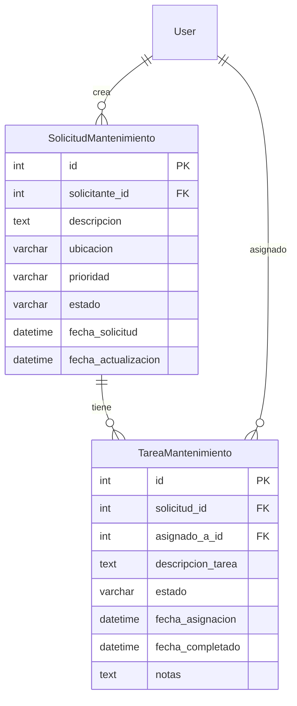

# Modelos de Datos - Módulo 7: Gestión de Mantenimiento

## Diagrama de Base de Datos



## Detalle de Modelos

### SolicitudMantenimiento

**Campos de Base de Datos:**
```python
class SolicitudMantenimiento(models.Model):
    solicitante = models.ForeignKey(
        settings.AUTH_USER_MODEL,
        on_delete=models.CASCADE,
        related_name='solicitudes_mantenimiento'
    )
    descripcion = models.TextField(verbose_name='Descripción del problema')
    ubicacion = models.CharField(max_length=255, verbose_name='Ubicación')
    prioridad = models.CharField(
        max_length=10,
        choices=PRIORIDAD_CHOICES,
        default='media'
    )
    estado = models.CharField(
        max_length=15,
        choices=ESTADO_CHOICES,
        default='pendiente'
    )
    fecha_solicitud = models.DateTimeField(default=timezone.now)
    fecha_actualizacion = models.DateTimeField(auto_now=True)
```

**Constraints:**
- `solicitante`: No puede ser nulo, cascade on delete
- `descripcion`: Campo obligatorio, texto largo
- `ubicacion`: Campo obligatorio, máximo 255 caracteres
- `prioridad`: Valores permitidos: baja, media, alta, urgente
- `estado`: Valores permitidos: pendiente, asignada, en_progreso, completada, cancelada

**Relaciones:**
- One-to-One con `TareaMantenimiento` (una solicitud puede tener máximo una tarea)
- Foreign Key con `User` (solicitante)

### TareaMantenimiento

**Campos de Base de Datos:**
```python
class TareaMantenimiento(models.Model):
    solicitud = models.OneToOneField(
        SolicitudMantenimiento,
        on_delete=models.CASCADE,
        related_name='tarea'
    )
    asignado_a = models.ForeignKey(
        settings.AUTH_USER_MODEL,
        on_delete=models.CASCADE,
        related_name='tareas_asignadas'
    )
    descripcion_tarea = models.TextField(verbose_name='Descripción de la tarea')
    estado = models.CharField(
        max_length=15,
        choices=ESTADO_CHOICES,
        default='asignada'
    )
    fecha_asignacion = models.DateTimeField(default=timezone.now)
    fecha_completado = models.DateTimeField(null=True, blank=True)
    notas = models.TextField(blank=True, verbose_name='Notas adicionales')
```

**Constraints:**
- `solicitud`: One-to-One, cascade on delete
- `asignado_a`: No puede ser nulo, cascade on delete
- `descripcion_tarea`: Campo obligatorio
- `estado`: Valores permitidos: pendiente, asignada, en_progreso, completada, cancelada
- `fecha_completado`: Solo se establece cuando estado = 'completada'

**Relaciones:**
- One-to-One con `SolicitudMantenimiento`
- Foreign Key con `User` (asignado_a)

## Choices Definidos

### PRIORIDAD_CHOICES
```python
PRIORIDAD_CHOICES = [
    ('baja', 'Baja'),
    ('media', 'Media'),
    ('alta', 'Alta'),
    ('urgente', 'Urgente'),
]
```

### ESTADO_CHOICES (Solicitud y Tarea)
```python
ESTADO_CHOICES = [
    ('pendiente', 'Pendiente'),
    ('asignada', 'Asignada'),
    ('en_progreso', 'En Progreso'),
    ('completada', 'Completada'),
    ('cancelada', 'Cancelada'),
]
```

## Métodos del Modelo

### SolicitudMantenimiento
- `__str__()`: Retorna "Solicitud #{id} - {ubicacion}"
- `save()`: Actualiza fecha_actualizacion automáticamente

### TareaMantenimiento
- `__str__()`: Retorna "Tarea #{id} - Solicitud #{solicitud.id}"
- `save()`: Establece fecha_completado cuando estado = 'completada'

## Índices y Optimizaciones

### Meta Configuración
```python
class Meta:
    verbose_name = 'Solicitud de Mantenimiento'
    verbose_name_plural = 'Solicitudes de Mantenimiento'
    ordering = ['-fecha_solicitud']  # Más recientes primero
```

```python
class Meta:
    verbose_name = 'Tarea de Mantenimiento'
    verbose_name_plural = 'Tareas de Mantenimiento'
    ordering = ['-fecha_asignacion']  # Más recientes primero
```

## Migraciones

### 0001_initial.py
```python
# Crear tablas
- backend_maintenance_solicitudmantenimiento
- backend_maintenance_tareamantenimiento

# Índices automáticos
- solicitante_id (SolicitudMantenimiento)
- solicitud_id (TareaMantenimiento)
- asignado_a_id (TareaMantenimiento)
```

## Consideraciones de Rendimiento

### Consultas Optimizadas
- `select_related()` para relaciones User en serializadores
- Filtros por estado y prioridad indexados
- Ordering por fecha para listados

### Carga de Datos
- Relaciones lazy loading por defecto
- Prefetch_related en vistas con múltiples relaciones

## Validaciones a Nivel de Modelo

### Save Method Overrides
- `TareaMantenimiento.save()`: Valida lógica de fecha_completado
- Actualización automática de timestamps

### Constraints de Base de Datos
- Foreign Keys con CASCADE
- Unique constraints en One-to-One (solicitud -> tarea)

## Extensibilidad

### Campos Futuros Planificados
- `categoria`: Tipo de mantenimiento (eléctrica, plomería, etc.)
- `costo_estimado`: Presupuesto aproximado
- `tiempo_estimado`: Duración prevista
- `adjuntos`: Archivos multimedia

### Relaciones Futuras
- Many-to-Many con proveedores externos
- Foreign Key a inventario de repuestos
- Relación con calendario de mantenimientos preventivos